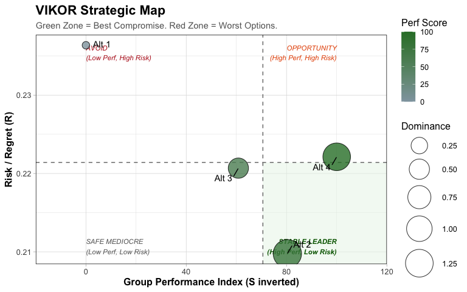
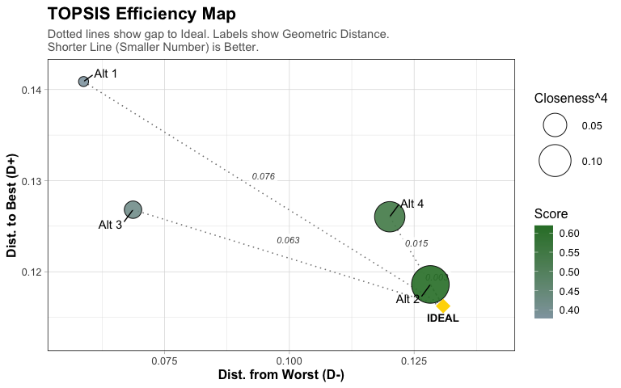
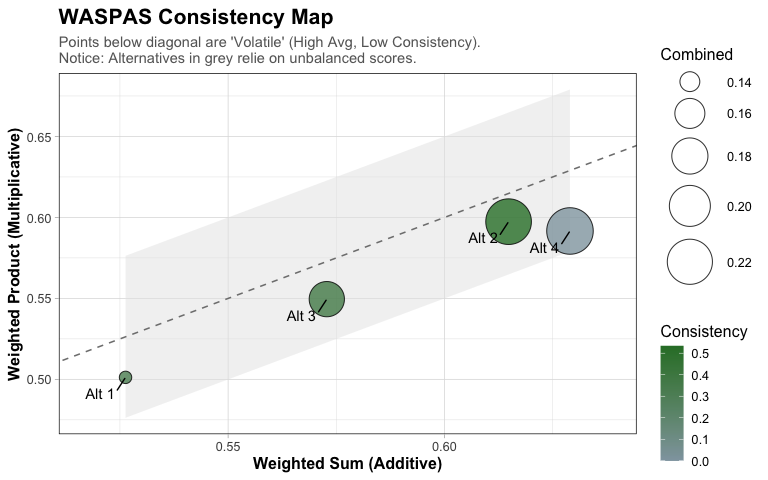
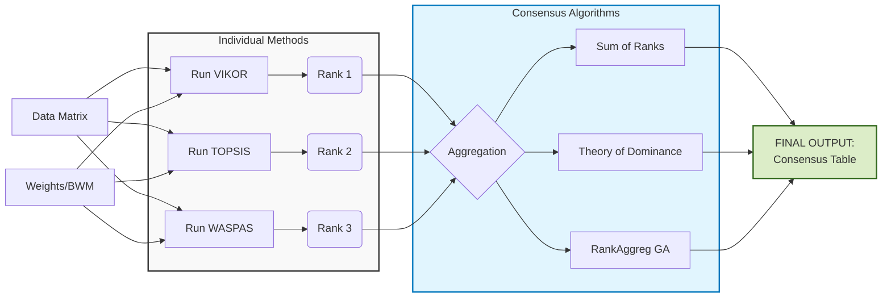

<!-- README.md is generated from README.Rmd. Please edit that file -->

# UnivRankR

<!-- badges: start -->

The goal of UnivRankR is to provide advanced Fuzzy Multi-Criteria
Decision Making (MCDM) methods including VIKOR, TOPSIS, and WASPAS,
along with state-of-the-art visualizations. It supports both data-driven
(Entropy) and expert-driven (Best-Worst Method) weighting schemes.
<!-- badges: end -->

The goal of UnivRankR is to …

## Installation

You can install the development version of UnivRankR from
[GitHub](https://github.com/) with:

``` r
# install.packages("devtools")
devtools::install_github("MarekDejaUJ/UnivRankR")
#> Using GitHub PAT from the git credential store.
#> Downloading GitHub repo MarekDejaUJ/UnivRankR@HEAD
#> isoband (0.2.7 -> 0.3.0) [CRAN]
#> Installing 1 packages: isoband
#> Installing package into '/private/var/folders/vh/njwnyy0141n0zbrgjw2vbz800000gn/T/RtmpsGQMJx/temp_libpath43d56c5bbdb3'
#> (as 'lib' is unspecified)
#> 
#> The downloaded binary packages are in
#>  /var/folders/vh/njwnyy0141n0zbrgjw2vbz800000gn/T//RtmpMHUCiB/downloaded_packages
#> ── R CMD build ─────────────────────────────────────────────────────────────────
#> * checking for file ‘/private/var/folders/vh/njwnyy0141n0zbrgjw2vbz800000gn/T/RtmpMHUCiB/remotes464a1866f3c8/MarekDejaUJ-UnivRankR-009fab4/DESCRIPTION’ ... OK
#> * preparing ‘UnivRankR’:
#> * checking DESCRIPTION meta-information ... OK
#> * checking for LF line-endings in source and make files and shell scripts
#> * checking for empty or unneeded directories
#> * building ‘UnivRankR_0.2.2.tar.gz’
#> Installing package into '/private/var/folders/vh/njwnyy0141n0zbrgjw2vbz800000gn/T/RtmpsGQMJx/temp_libpath43d56c5bbdb3'
#> (as 'lib' is unspecified)
```

## Example

This example demonstrates how to process raw survey data, apply fuzzy
logic, and rank alternatives using three different MCDM methods.

### 1. Load Data

We use the built-in dataset `mcdm_raw_data`.

``` r
library(UnivRankR)
data("mcdm_raw_data", package = "UnivRankR")
head(mcdm_raw_data)
#>   ExpertID Alternative cost_raw_mat cost_labor qual_durability qual_finish
#> 1        1  Supplier_A    1957.4030   240.5821               4           3
#> 2        1  Supplier_B     578.9526   536.8628               1           3
#> 3        1  Supplier_C    1300.8831   242.4331               3           5
#> 4        1  Supplier_D    1098.4972   326.8352               2           5
#> 5        2  Supplier_A    1820.8728   529.7722               5           2
#> 6        2  Supplier_B     781.8234   489.1889               4           5
#>   qual_defects qual_ux del_time_avg del_reliability del_tracking sus_co2
#> 1            2       4    11.281919        83.33566            0       1
#> 2            4       2     3.106532        96.70219           10       3
#> 3            5       1     2.194921        82.22157           10       3
#> 4            5       2     6.002115        85.36140           10       6
#> 5            3       1     4.902237        95.96962            0       4
#> 6            2       3    11.504849        85.97859            0       4
#>   sus_waste sus_material sus_social
#> 1         4            3          1
#> 2         1            4          4
#> 3         4            3          3
#> 4         7            4          6
#> 5         4            1          5
#> 6         3            3          3
```

### 2. Define Measurement Model

We define how the raw survey items map to the four decision criteria:
Cost, Quality, Delivery, and Sustainability.

``` r
mcdm_syntax <- "
  Cost           =~ cost_raw_mat + cost_labor;
  Quality        =~ qual_durability + qual_finish + qual_defects + qual_ux;
  Delivery       =~ del_time_avg + del_reliability + del_tracking;
  Sustainability =~ sus_co2 + sus_waste + sus_material + sus_social
"
```

### 3. Prepare Data

We process the raw data by aggregating the 20 expert responses into
scores for the 4 Suppliers (Alternatives), scaling them to Saaty’s 1-9
scale, and fuzzifying them.

``` r
d_mat <- prepare_mcdm_data(
  data = mcdm_raw_data, 
  syntax = mcdm_syntax, 
  alternative_col = "Alternative" # Aggregate by this column
)

# The result is a 4x12 matrix (4 Suppliers x 3 Fuzzy Values per 4 Criteria)
print(d_mat)
#>                   l        m        u        l        m        u        l
#> Supplier_A 6.201472 7.201472 8.201472 1.000000 2.000000 3.000000 3.490560
#> Supplier_B 1.277710 2.277710 3.277710 1.483019 2.483019 3.483019 3.211605
#> Supplier_C 3.741383 4.741383 5.741383 1.000000 1.988679 2.988679 4.451122
#> Supplier_D 3.934881 4.934881 5.934881 1.000000 1.490566 2.490566 3.990678
#>                   m        u    l    m    u
#> Supplier_A 4.490560 5.490560 2.28 3.28 4.28
#> Supplier_B 4.211605 5.211605 2.36 3.36 4.36
#> Supplier_C 5.451122 6.451122 2.74 3.74 4.74
#> Supplier_D 4.990678 5.990678 6.28 7.28 8.28
#> attr(,"criteria_names")
#> [1] "Cost"           "Quality"        "Delivery"       "Sustainability"
print(attr(d_mat, "criteria_names"))
#> [1] "Cost"           "Quality"        "Delivery"       "Sustainability"

# Calculate the crisp weights (one per criterion) for later use
w_entropy <- calculate_entropy_weights(d_mat)
print(round(w_entropy, 3))
#> [1] 0.463 0.084 0.032 0.421

# Expand weights to match fuzzy matrix structure
w_expanded <- rep(w_entropy, each = 3)

# Define BWM parameters for later use
bwm_best_vec  <- c(8, 1, 3, 2) 
bwm_worst_vec <- c(1, 8, 4, 6)
```

### 4. Run Analysis (BWM Weights)

We run the analysis using the expert’s Best-Worst Method (BWM)
preferences.

``` r
crit_types <- c("min", "max", "max", "max")

# 1. Fuzzy VIKOR (Compromise Solution)
res_vikor <- fuzzy_vikor(
  decision_mat = d_mat,
  criteria_types = crit_types,
  bwm_best = bwm_best_vec,
  bwm_worst = bwm_worst_vec
)
#> Calculating weights using BWM...

# 2. Fuzzy TOPSIS (Distance to Ideal)
res_topsis <- fuzzy_topsis(
  decision_mat = d_mat,
  criteria_types = crit_types,
  bwm_best = bwm_best_vec,
  bwm_worst = bwm_worst_vec
)
#> Calculating weights using BWM...

# 3. Fuzzy WASPAS (Weighted Aggregation)
res_waspas <- fuzzy_waspas(
  decision_mat = d_mat,
  criteria_types = crit_types,
  bwm_best = bwm_best_vec,
  bwm_worst = bwm_worst_vec
)
#> Calculating weights using BWM...

# Print BWM outputs
print(res_vikor)
#> $results
#>   Alternative     Def_S     Def_R     Def_Q Ranking
#> 1           1 0.3700153 0.2363636 0.5114020       4
#> 2           2 0.2477498 0.2097624 0.4389256       1
#> 3           3 0.2774926 0.2206818 0.4611355       3
#> 4           4 0.2178105 0.2221288 0.4406131       2
#> 
#> $details
#> $details$S_fuzzy
#>            [,1]      [,2]      [,3]
#> [1,] -0.2443131 0.3700153 0.9843437
#> [2,] -0.3665786 0.2477498 0.8620782
#> [3,] -0.3362763 0.2780521 0.8901423
#> [4,] -0.3713383 0.2429901 0.7566000
#> 
#> $details$R_fuzzy
#>             [,1]      [,2]      [,3]
#> [1,] 0.090909091 0.1818182 0.4909091
#> [2,] 0.087272727 0.1781818 0.3954131
#> [3,] 0.070000000 0.1609091 0.4909091
#> [4,] 0.005177204 0.1962144 0.4909091
#> 
#> $details$Q_fuzzy
#>            [,1]      [,2]      [,3]
#> [1,] 0.13509940 0.4552543 1.0000000
#> [2,] 0.08626251 0.4064174 0.8566052
#> [3,] 0.07965844 0.3998133 0.9652568
#> [4,] 0.00000000 0.4232242 0.9160040
#> 
#> 
#> $params
#> $params$v
#> [1] 0.5
#> 
#> 
#> attr(,"class")
#> [1] "fuzzy_vikor_res"
print(res_topsis)
#> $results
#>   Alternative    D_plus    D_minus     Score Ranking
#> 1           1 0.1408703 0.05877808 0.3778896       4
#> 2           2 0.1186101 0.12824498 0.6193818       1
#> 3           3 0.1268106 0.06868630 0.4141545       3
#> 4           4 0.1260351 0.12010812 0.5462663       2
#> 
#> $method
#> [1] "TOPSIS"
#> 
#> attr(,"class")
#> [1] "fuzzy_topsis_res"
print(res_waspas)
#> $results
#>   Alternative       WSM       WPM     Score Ranking
#> 1           1 0.5262903 0.5012458 0.5137680       4
#> 2           2 0.6148059 0.5973871 0.6060965       2
#> 3           3 0.5728011 0.5495522 0.5611767       3
#> 4           4 0.6289915 0.5916376 0.6103146       1
#> 
#> $method
#> [1] "WASPAS"
#> 
#> $lambda
#> [1] 0.5
#> 
#> attr(,"class")
#> [1] "fuzzy_waspas_res"
```

### 5. Plot BWM Results

We visualize the results using three distinct maps: **Performance-Risk
(VIKOR)**, **Efficiency (TOPSIS)**, and **Robustness (WASPAS)**.

``` r
plot(res_vikor)
```



``` r
plot(res_topsis)
```



``` r
plot(res_waspas)
```



### 6. Run Analysis with Entropy (Data-Driven)

We now run the same analysis using objective Entropy weights derived
purely from the data variance. Note that we pass `weights` and remove
the `bwm_` arguments.

``` r
### --- A. Fuzzy VIKOR ---
res_vikor_ent <- fuzzy_vikor(
  decision_mat = d_mat,
  criteria_types = crit_types,
  weights = w_expanded
)

### --- B. Fuzzy TOPSIS ---
res_topsis_ent <- fuzzy_topsis(
  decision_mat = d_mat,
  criteria_types = crit_types,
  weights = w_expanded
)

### --- C. Fuzzy WASPAS ---
res_waspas_ent <- fuzzy_waspas(
  decision_mat = d_mat,
  criteria_types = crit_types,
  weights = w_expanded
)

# Print Entropy outputs
print(res_vikor_ent)
#> $results
#>   Alternative     Def_S     Def_R     Def_Q Ranking
#> 1           1 0.6356626 0.3292540 0.6822531       4
#> 2           2 0.2872396 0.2748944 0.4649686       2
#> 3           3 0.4296178 0.2482465 0.4954588       3
#> 4           4 0.2115324 0.1776861 0.3158624       1
#> 
#> $details
#> $details$S_fuzzy
#>             [,1]      [,2]      [,3]
#> [1,]  0.27410357 0.6356626 0.9972217
#> [2,] -0.07431950 0.2872396 0.6487986
#> [3,]  0.06815442 0.4297135 0.7908897
#> [4,] -0.14571900 0.2158401 0.5601684
#> 
#> $details$R_fuzzy
#>            [,1]      [,2]      [,3]
#> [1,] 0.19551317 0.3292540 0.4629948
#> [2,] 0.13464215 0.2748944 0.4151466
#> [3,] 0.10799423 0.2482465 0.3884987
#> [4,] 0.04394533 0.1776861 0.3114269
#> 
#> $details$Q_fuzzy
#>           [,1]      [,2]      [,3]
#> [1,] 0.3645062 0.6822531 1.0000000
#> [2,] 0.1394523 0.4649686 0.7904848
#> [3,] 0.1699844 0.4955007 0.8208494
#> [4,] 0.0000000 0.3177469 0.6279559
#> 
#> 
#> $params
#> $params$v
#> [1] 0.5
#> 
#> 
#> attr(,"class")
#> [1] "fuzzy_vikor_res"
print(res_topsis_ent)
#> $results
#>   Alternative    D_plus    D_minus      Score Ranking
#> 1           1 0.2929038 0.01006679 0.03721158       4
#> 2           2 0.1792148 0.22970285 0.57616314       2
#> 3           3 0.1984891 0.11672733 0.37984642       3
#> 4           4 0.1254708 0.21094189 0.64354513       1
#> 
#> $method
#> [1] "TOPSIS"
#> 
#> attr(,"class")
#> [1] "fuzzy_topsis_res"
print(res_waspas_ent)
#> $results
#>   Alternative       WSM       WPM     Score Ranking
#> 1           1 0.3205832 0.2873453 0.3039642       4
#> 2           2 0.5527443 0.5357122 0.5442282       1
#> 3           3 0.3939982 0.3744934 0.3842458       3
#> 4           4 0.5582346 0.4772628 0.5177487       2
#> 
#> $method
#> [1] "WASPAS"
#> 
#> $lambda
#> [1] 0.5
#> 
#> attr(,"class")
#> [1] "fuzzy_waspas_res"
```

### 7. Compare Rankings

Finally, we compare how the ranking changes depending on whether we use
Expert opinion (BWM) or Data variance (Entropy).

``` r
comparison <- data.frame(
  Supplier = rownames(d_mat),
  Rank_BWM = res_vikor$results$Ranking,          # From Section 4
  Rank_Entropy = res_vikor_ent$results$Ranking   # From Section 6
)
print(comparison)
#>     Supplier Rank_BWM Rank_Entropy
#> 1 Supplier_A        4            4
#> 2 Supplier_B        1            2
#> 3 Supplier_C        3            3
#> 4 Supplier_D        2            1
```

## 8. Meta-Ranking Consensus

Different MCDM methods can sometimes yield slightly different rankings
due to their mathematical assumptions. To ensure the robustness of our
decision, we use the `fuzzy_meta_ranking()` function.

**Figure 1: Meta-Ranking Workflow**

``` text
[ INPUTS ]
   Data Matrix  ----.
   Weights (BWM) ---+---> [ INTERNAL STEP: Run VIKOR ]  ----> Ranking 1
                    |
                    +---> [ INTERNAL STEP: Run TOPSIS ] ----> Ranking 2
                    |
                    '---> [ INTERNAL STEP: Run WASPAS ] ----> Ranking 3
                                                                 |
                                                                 v
                                                     [ CONSENSUS ALGORITHMS ]
                                                     1. Sum of Ranks
                                                     2. Theory of Dominance
                                                     3. RankAggreg (GA)
                                                                 |
                                                                 v
                                                          [ FINAL OUTPUT ]
                                                          Consensus Table
```

### Meta-Ranking Workflow

The `fuzzy_meta_ranking()` function follows this internal logic:



This aggregates the results from VIKOR, TOPSIS, and WASPAS using three
consensus algorithms: 1. **Sum of Ranks:** Simple arithmetic sum (lower
is better). 2. **Theory of Dominance:** A voting mechanism based on
pairwise comparisons. 3. **Rank Aggregation:** Uses an evolutionary
algorithm (via the `RankAggreg` package) to find the optimal list
ordering.

``` r
# Run the Meta-Ranking using the Expert (BWM) preferences
meta_res <- fuzzy_meta_ranking( decision_mat = d_mat, criteria_types =
crit_types, bwm_best = bwm_best_vec, bwm_worst = bwm_worst_vec )
#> Calculating weights using BWM...
#> Calculating weights using BWM...
#> Calculating weights using BWM...
```

### 1. View the Consolidated Ranking Table

``` r
# This shows how the 3 methods ranked the suppliers, and the final Consensus

print(meta_res$comparison)
#>   Alternative R_VIKOR R_TOPSIS R_WASPAS Meta_Sum Meta_Dominance Meta_Aggreg
#> 1  Supplier_A       4        4        4        4              4           4
#> 2  Supplier_B       1        1        2        1              1           1
#> 3  Supplier_C       3        3        3        3              3           3
#> 4  Supplier_D       2        2        1        2              2           2
```

### 2. Check Method Consistency (Correlation)

``` r
# High correlation (>0.9) indicates strong agreement between methods

print(round(meta_res$correlations, 2))
#>                R_VIKOR R_TOPSIS R_WASPAS Meta_Sum Meta_Dominance Meta_Aggreg
#> R_VIKOR            1.0      1.0      0.8      1.0            1.0         1.0
#> R_TOPSIS           1.0      1.0      0.8      1.0            1.0         1.0
#> R_WASPAS           0.8      0.8      1.0      0.8            0.8         0.8
#> Meta_Sum           1.0      1.0      0.8      1.0            1.0         1.0
#> Meta_Dominance     1.0      1.0      0.8      1.0            1.0         1.0
#> Meta_Aggreg        1.0      1.0      0.8      1.0            1.0         1.0
```
